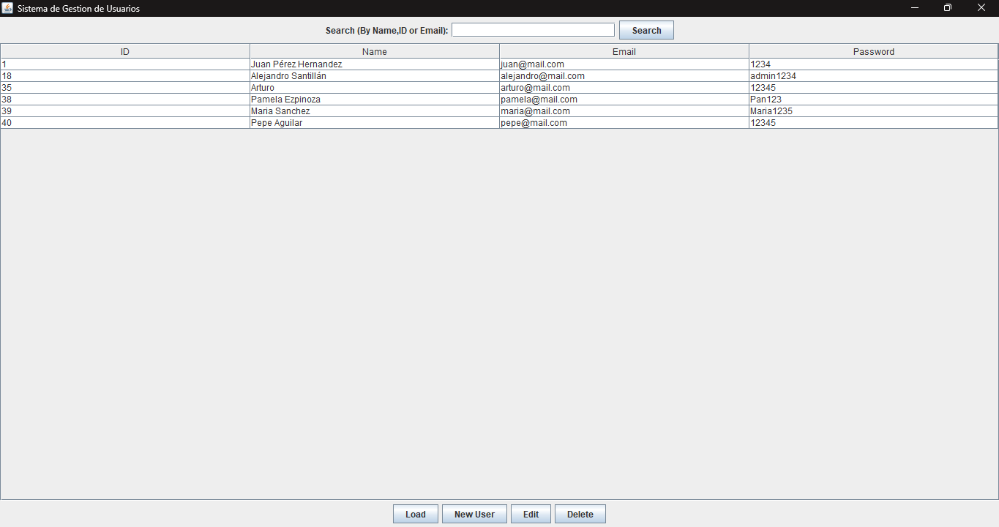
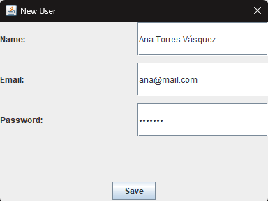
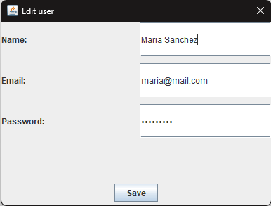
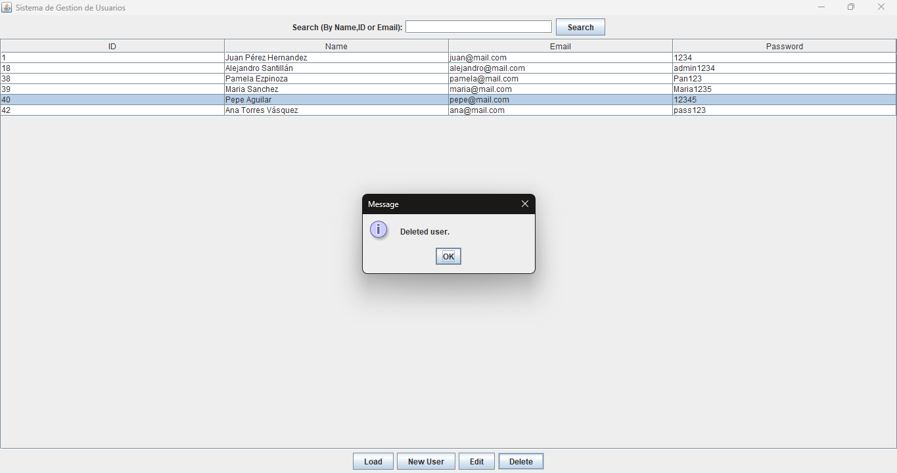

# Sistema CRUD de usuarios (Java Swing + JDBC + MySQL)

<p>Este proyecto es una aplicación de escritorio desarrollado en Java 23, el cual implementa un sistema CRUD (Create,Read,Update,Delete) para la gestión de usuarios.</p>
<p>Utiliza Java Swing para la interfaz gráfica, JDBC para la conexión de bases de datos y MySQL como gestor de base de datos.</p>

## Caracteristicas
<li>Registro de usuarios.</li>
<li>Visualización de usuario en tabla (JTable)</li>
<li>Edición de usuarios</li>
<li>Validación de email</li>
<li>Recarga dinámica de datos</li>
<li>Interfaz gráfica con Swing</li>

## Tecnologias usadas
<li>Java JDK 23</li>
<li>Java Swing</li>
<li>Java JDBC</li>
<li>MySQL</li>
<li>Intellij IDEA</li>

## Base de datos
### Script de creación
```sql
CREATE TABLE usuarios (
    id INT AUTO_INCREMENT PRIMARY KEY,
    nombre VARCHAR(100) NOT NULL,
    email VARCHAR(100) NOT NULL UNIQUE,
    password VARCHAR(255) NOT NULL,
);
```

## Configuración
1. Clonar el repositorio
[git clone] (https://github.com/AlejandroSC-dev/CRUD-Sistema-de-Gestion-de-Usuarios.git)

2. Configurar conexión en:
<p>util/DBConector.java</p>

Ejemplo:
```java
private static final String URL = "jdbc:mysql://localhost:3306/tu_db";
private static final String USER = "root";
private static final String PASSWORD = "tu_password";
```
3. Ejecutar la aplicación
```java
Run userForm.java
```

# Funcionalidades del sistema
<li>Listado de usuerios</li>
<li>Registro de nuevos usuarios</li>
<li>Edición de usuarios existentes</li>
<li>Elimincación de usuarios</li>
<li>Recarga de datos</li>

# Vista previa










## Este proyecto fue desarrollado como práctica para portafolio enfocado en:
<li>JDBC</li>
<li>Desarrollo de aplicaciones de escritorio</li>
<LI>MySQL</LI>
